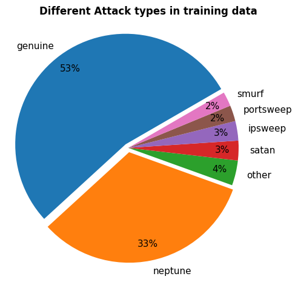

# Intrusion Detection System using Machine Learning

This repository contains my capstone project for the Coding Bootcamp for Cybersecurity Professionals (October - Novermber, 2025).</br>
The goal of the project is to demonstrate practical understanding of python, data analysis and machine learning fundamentals, applied to a cybersecurity use case.

**Project Goal**: 
Build a simple intrusion detection system (IDS) that classifies network traffic as genuine or malicious using supervised machine learning.

# Dataset 

-   **NSL-KDD99** with seperate datasets for model training and testing
-   Datasets were downloaded from **kaggle**, a description and overview of the data can be found [here](eda/data_description.md).

-   Feature `attack type` was used to create a **target variable** for **binary classification**:
    -   `0` &rarr; genuine network traffic
    -   `1` &rarr; malicious network traffic 

    


# Approach & Methodology

## Exploratory Data Analysis (EDA)

- Performed extensive EDA to understand feature distributions and relationships, documented in the [eda](eda/eda.ipynb) notebook 
- Selected and transformed features based on EDA insights to improve model performance &rarr; `features_for_preprocessing.json`

## Modeling & Evaluation

### Evaluation Metrics

Models were evaluated on both training and unseen test data using **Accuracy**, **Precision**, and **Recall**. 
-   Accuracy provides a general performance overview
-   Recall was emphasized over precision due to the intrusion detection context, where missing malicious traffic is typically more costly than false alarms

### Baseline Models

Several baseline models were implemented:
- Always predict a single class
- Random prediction
- A simple protocol-based heuristic derived from EDA

These models performed at or near chance level (~50% accuracy) on unseen data, providing a meaningful benchmark for evaluating more complex approaches.

### Random Forest Classifier

The primary model used was a Random Forest classifier, selected for its ability to handle heterogeneous feature types and capture non-linear relationships in network traffic data. 

- Multiple Random Forest variants were trained and evaluated 

- The best-performing model was saved as: `model/random_forest_model.pkl` and can be loaded directly to make predictions on new data   

## Results & Key Insights

Baseline vs. Random Forest Performance (Test Data)


| Model	| Accuracy	| Precision	| Recall|
| --- | ----------- |---|---|
|Baseline (best)	|0.58	|0.84	|0.12|
|Random Forest (basic)	|0.81	|0.91	|0.74|
|Random Forest (best)	|0.84	|0.92	|0.80|

</br>

- Baseline models performed at or near chance level (~50% accuracy), highlighting the need for more complex models.
- Random Forest models outperformed baselines and generalized reasonably well to unseen data.
- The basic Random Forest showed signs of overfitting, performing much better on training than test data.
- Hyperparameter tuning improved generalization and recall.
- The best-performing model achieved an accuracy of 84%, precision of 92%, and recall of 80% on the test set.
- Even the best model still misses some attacks, highlighting opportunities for further improvement.
-   Model creation and evaluation is documented in the [model](model/model.ipynb) notebook. A summary and disusssion can be found [here](model/model_summary.md).  

# Features

- Train and evaluate multiple models for intrusion detection
- Compare baseline models against a Random Forest classifier
- Run predictions via a command-line interface
- Optionally evaluate predictions using known labels
- Modular structure to support experimentation and future extensions

# How to run the program

## 1.  Set up the virtual environment

### Mac0S/Linux
```bash
pyenv local 3.11.3
python -m venv .venv
source .venv/bin/activate
pip install --upgrade pip
pip install -r requirements.txt
```

### Windows (Git Bash)
```bash
pyenv local 3.11.3
python -m venv .venv
source .venv/Scripts/activate
python.exe -m pip install --upgrade pip
pip install -r requirements.txt
```

* Hint when pip installing requirements: 
    -   use `--upgrade` flag carefully
    -   optionally try a dry run: `pip install --upgrade --upgrade-strategy only-if-needed --dry-run -r requirements.txt`
    -   when there are no conflicts, use: `pip install --upgrade --upgrade-strategy only-if-needed -r requirements.txt`


## 2. Add `.gitignore` file

To avoid committing environment variables or datasets:
- Add `.env` and `data/` to your .gitignore
- works for Git Bash and macOS/Linux

```bash
{
  echo ""
  echo "# Environment and data files"
  grep -qxF '.env' .gitignore || echo '.env'
  grep -qxF 'data/' .gitignore || echo 'data/'
} >> .gitignore
```


## 3. Download the data set

Download the NSL-KDD99 dataset from [kaggle](https://www.kaggle.com/datasets/kaggleprollc/nsl-kdd99-dataset/data) and save in in the `data/` directory.

- You **do not need the dataset** if you want to:
    - Run predictions using the provided models
    - Use the included test input files
    - Or provide your own input (in the same format as the test input)
    
- You **need the dataset** if you want to:
    - Train models from scratch
    - Run the notebooks for [eda](eda/eda.iypnb) and [modeling](model/model.ipynb) 
    - Generate custom test input files from the kaggle data set using the `create_test_input.py` script </br>&rarr; run `create_test_input.py nr_cases` from CLI, where `nr_cases` is and integer between 1 and 22544 (max number of cases in the test data set) 
  


## 4.  Run predictions

Predictions are made using `predict.py`, which supports two modes depending on the number of CLI arguments.

### Mode 1: Prediciton only 

| Required arguments | Output |
| --- | --- |
| model name </br>X-values file (txt or csv)  |`prediction.txt` containing one prediction per input row |

### Mode 2: Prediction and evaluation

| Required arguments | Output |
| --- | --- |
| model name </br>X-values file </br>corresponding y-values file |`prediction.txt` </br>printed classification report|


---
### Available models
- `RF` &rarr; Random Forest Classifier (best)
- `BM_mal` &rarr; Baseline, always predicting malicious
- `BM_rand` &rarr; Baseline, random prediction
- `BM_protocol` &rarr; Baseline, predict malicious when protocol is 'imcp' 
---

### Input Specifications
` X-values`
- Must match feature format used for training
- Example files created from test data set:
    - `test_input_X_1.txt` (1 input case)
    - `test_input_X_20.txt` (20 input cases)  
        
`y-values`
- Required only for evaluation 
- Number of labels must match the numer of X-values 
    - `test_input_y_1.txt` (1 input case)
    - `test_input_y_20.txt` (20 input cases)  

## 5. Example commands 

### Prediction only
Predict whether network traffic of one example case is genuine or malicious with the random baseline model.

```bash
python predict.py BM_rand test_input_X_1.txt
```


### Prediction and evaluation
Predict whether network traffic of 20 example cases is genuine or malicious with the Random Forest Classifier and print a classification report.

```bash
python predict.py RF test_input_X_20.txt test_input_y_20.txt
```

## 6. Interpreting results

- Predictions are written to `prediction.txt`
    - `0` &rarr; genuine traffic
    - `1` &rarr; malicious traffic
- When model evaluation is enabled, a classification report is printed to compare accuracy, precision, and recall (discussed [here](model/model_summary.md)).


# Future improvements

To keep the project within a reasonable timeframe, I intentionally limited further optimization of the Random Forest model. Additional iterations of the machine learning workflow (such as more extensive feature selection and engineering, refined preprocessing, and systematic hyperparameter tuning) could potentially yield improved performance.

Beyond model optimization, several areas offer clear opportunities for future enhancement:

-   Improve evaluation outputs and reporting for clearer model comparison and interpretability
-   Automate dataset retrieval and updates using the Kaggle API
-   Refactor EDA code into reusable scripts
-   Extend preprocessing steps and integratem them within the modeling pipeline
-   Train and compare additional models (e.g. XGBoost) to benchmark performance against the current approach