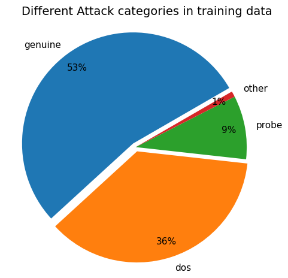
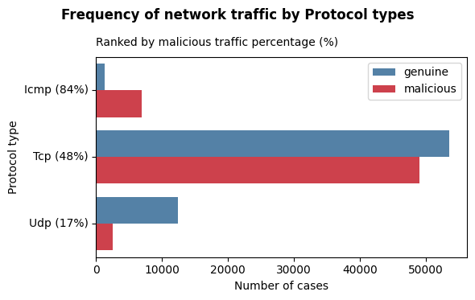
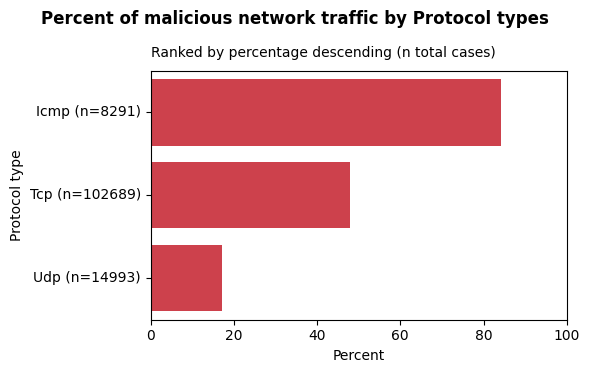
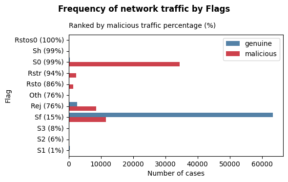
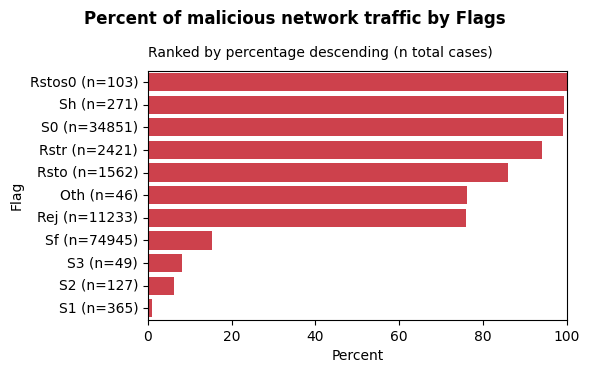
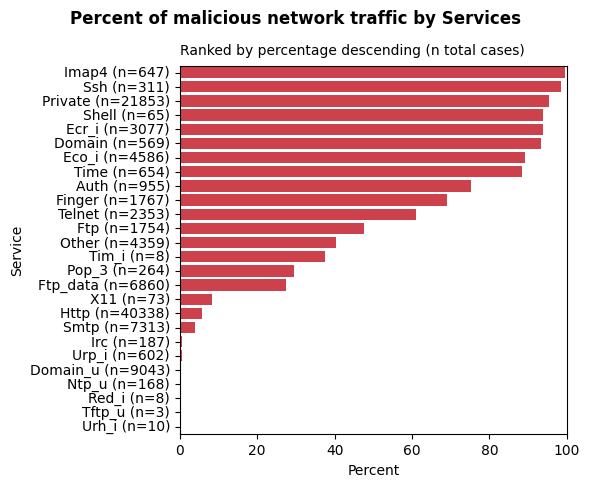
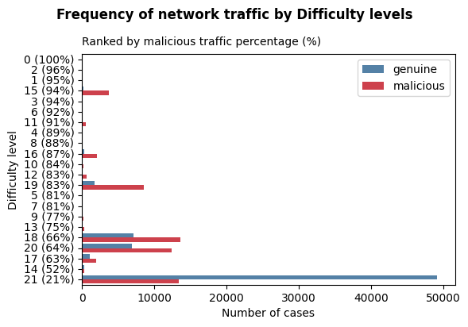
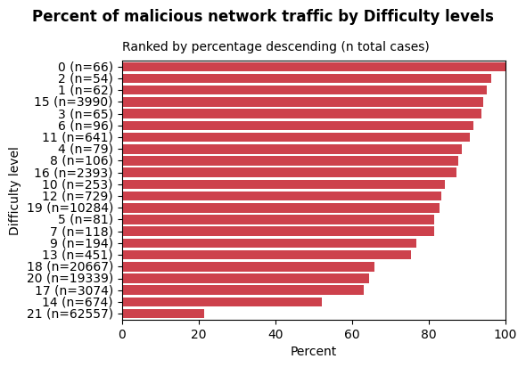

# 1. Data source and import 

The analysis is based on the network infiltration dataset (NSL-KDD99) downloaded from [kaggle](https://www.kaggle.com/datasets/kaggleprollc/nsl-kdd99-dataset/data).

When importing the data with pandas I used the following code to include the column names:

```
import pandas as pd

file_name_train_data = "KDDTrain+.txt"
file_name_test_tata = "KDDTest+.txt"
file_path = "path_to_file"

column_names = [
    "duration", "protocol_type", "service", "flag", "src_bytes", "dst_bytes", "land", "wrong_fragment", "urgent", "hot", "num_failed_logins", "logged_in", "num_compromised", "root_shell", "su_attempted", "num_root", "num_file_creations", "num_shells", "num_access_files", "num_outbound_cmds", "is_host_login", "is_guest_login", "count", "srv_count", "serror_rate" "srv_serror_rate", "rerror_rate", "srv_rerror_rate", "same_srv_rate", "diff_srv_rate", "srv_diff_host_rate", "dst_host_count", "dst_host_srv_count", "dst_host_same_srv_rate", "dst_host_diff_srv_rate", "dst_host_same_src_port_rate", "dst_host_srv_diff_host_rate", "dst_host_serror_rate", "dst_host_srv_serror_rate", "dst_host_rerror_rate", "dst_host_srv_rerror_rate", "attack_type", "difficulty_level"
]

# load data as df
train_data = pd.read_csv(file_path + file_name_train_data,  names=column_names)
test_data = pd.read_csv(file_path + file_name_test_tata, names=column_names)

```
</br>

# 2. Data overview 

Overview and description of the variables in the datasets.
-   The training data frame has 125973 rows and 43 columns.
-   The test data frame has 22544 rows and 43 columns.   

Plots and descriptive statistics always refer to the training data set.

| Column name | Column values| Description |
| --- | ----------- |---|
| duration | M = 287.14</br>SD = 2604.52 | Duration of the connection in seconds |
| [protocol_type](#feature-protocol_type) | categorical, 3 types | Type of protocol ([TCP](#tcp---transmission-control-protocol), [UDP](#udp---user-datagram-protocol), [ICMP](#icmp---internet-control-message-protocol)) |
| [service](#feature-service) |  categorical, 70 different services | Network service on the destination (http, ftp, smtp, ...)  |
| [flag](#feature-flag) |  categorical, 11 different flags | Status of connection</br>(SF, S0, REJ, RSTR, SH, RSTO, S1, RSTOS0, S3, S2, OTH)  |
| src_bytes |  M = 0.05 MB</br> SD = 5.87 MB | Bytes sent from source to destination |
| dst_bytes |  M = 0.02 MB</br> SD = 4.02 MB  | Bytes sent from destination to source |
| land | bool | 1: connection to/from same host <br/>0: otherwise |
| wrong_fragment |  0, 1, 3 | Nr of wrong fragments |
| urgent | 0-3 | Nr of urgent packets |
| hot | 28 different values in range 0-77 | Nr of hot indicatiors |
| num_failed_logins |  0-5 | Nr of failed login attempts |
| logged_in |  bool  | 1: successfully logged in <br/>0: otherwise|
| num_compromised |  88 different values in range 0-7479 | Nr of compromised conditions |
| root_shell |  bool | 1: root shell obtained <br/>0: otherwise |
| su_attempted |  0, 1, 2 | 'su root' command attempt |
| num_root | 82 different values in range 0-7468| Nr of root accesses |
| num_file_creations | 35 different values in range 0-43 | Nr of file creation operations |
| num_shells |  0,1,2 | Nr of shell prompts invoked |
| num_access_files |  0-9 | Nr of access file control operations |
| num_outbound_cmds |  always 0 | Nr of outbound commands |
| is_host_login |  bool | 1: login belongs to host </br>0: otherwise |
| is_guest_login |  bool | 1: login from guest account <br/>0: otherwise |
| count |  M = 84.11 </br>SD = 114.51 | Nr of connections to **same host** as current connection in past 2s |
| srv_count |   M = 27.74 </br>SD = 72.64 | Nr of connections to the **same service** as current connection in past 2s |
| serror_rate |  M = 0.28 </br>SD = 0.45 | Percentage of connections with **SYN** errors |
| srv_serror_rate | M = 0.28 </br>SD = 0.45 | Percentage of connections with **SYN** errors for same service|
| rerror_rate |  M = 0.12 </br>SD = 0.32| Percentage of connections with **REJ** errors |
| srv_rerror_rate | M = 0.12 </br>SD = 0.32 | Percentage of connections with **REJ** errors for same service|
| same_srv_rate |  M = 0.66 </br>SD = 0.44  | Percentage of connections to the same service|
| diff_srv_rate |  M = 0.06 </br>SD = 0.18  | Percentage of connections to different services|
| srv_diff_host_rate |  M = 0.10 </br>SD = 0.26 | Percentage of connections to different hosts|
| dst_host_count |  M = 182.15 </br>SD = 99.21  | Nr of destinations hosts accessed|
| dst_host_srv_count |  M = 115.65 </br>SD = 110.70 | Count of connections to the same service at the destination|
| dst_host_same_srv_rate |  M = 0.52 </br>SD = 0.45 | Percentage of connections to the **same service** at the destination|
| dst_host_diff_srv_rate |  M = 0.08 </br>SD = 0.19  | Percentage of connections to **different services** at the destination|
| dst_host_same_src_port_rate |  M = 0.15 </br>SD = 0.31  | Percentage of connections to same source port |
| dst_host_srv_diff_host_rate |  M = 0.03 </br>SD = 0.11  | Percentage of different hosts connected via same service |
| dst_host_serror_rate |  M = 0.28 </br>SD = 0.44  | Percentage of **SYN** errors at the destination host |
| dst_host_srv_serror_rate |  M = 0.28 </br>SD = 0.45 | Percentage of **SYN** errors for the same service at the destination |
| dst_host_rerror_rate |  M = 0.12 </br>SD = 0.31 | Percentage of **REJ** errors at the destination host |
| dst_host_srv_rerror_rate |  M = 0.12 </br>SD = 0.32  | Percentage of **REJ** errors for the same service at the destination |
| [attack_type](#feature-attack_type) |  categorical, 23 different types | normal, neptune, warezclient, ipsweep, portsweep, teardrop, nmap, satan, smurf, pod, back, guess_passwd, ftp_write, multihop, rootkit, buffer_overflow, imap, warezmaster, phf, land, loadmodule, spy, perl |
| [difficulty_level](#feature-difficulty_level) |  22 different values in range 0-21 |  |

# 3. Data description

Short summary of some of the variables that are explored in more detail in the [eda notebook](../eda/eda.ipynb).

Plots and descriptive statistics always refer to the training data set.

## Feature `attack_type`

- This feature is used to create a binary target variable, because it identifies genuine vs malicious network traffic. 
- In the training data set 53.46 % of cases are genuine network traffic. 
- For display: Attack types with < 2% occurence are summarized to 'other' category. 

    

- Grouping attack types is by categories is another possibility that could be used for multiclass classification:
    - Denial of Service (DoS)
    - Scanning/Reconnaissance (Probe)
    - Remote to local (R2L)
    - User to Root Escalation (U2R)
- For display: Categories with < 2 % occurences are summarized to 'other' category.

       


## Feature `protocol_type`
-   Overview of protocol types associated with malicious network traffic in the train data set (ranked by %).
    -   When icmp is used as a protocol type 84% of the network traffic is malicious in the train data set. 
    -   It is the most risky protocol type, although the total number of cases in the data set is relatively small (n = 8291).
    -   This observation was used as a simple heuristc for a baseline model (`BM_protocol`) and discussed in [model comparison](../model/model_summary.md).

     

     


## Feature `flag`
-   Overview of flags associated with malicious network traffic in the train data set (ranked by %).
    -   The most frequent flag is 'Sf' with 74945 cases and 15% malicious network traffic.
    -   The second most frequent flag 'S0' has 34851 cases of which 99% are malicious network traffic. 
    -   For the third most frequent flag 'Rej' 76% of 11233 cases in total are malicious network traffic. 

     

     

## Feature `service`
 - This feature has 70 categories that are plotted in full in the [eda notebook](../eda/eda.ipynb).
    -   As an overview only the 26 categories with less than 100% malicious network traffic are shown here. 
    -   All remaining 44 categories are associtated with 100% malicious network traffic.

     

## Feature `difficulty_level`
-   Overview of difficulty levels associated with malicious network traffic in the train data set (ranked by %).
    -   With the highest difficulty level (21), the percentage of malicious network traffic is the lowest (21%).
    -   With the lowest difficulty level (0), the percentage of malicious network traffic is the highest (100%).
    - Between level 1 and 20 the relation is less clear.

     

     

# 4. Background information 

Some background knowledge and variables explained in more detail. 

## TCP/IP model

- The Transmission Control Protocol/ Internet Protocol model defines data transmission across networks (modern internet) and consists of 4 layers:
    1. **Application**: handles high lvl protocols like HTTP, FTP, SSH, DNS
    2. **Transport**: enables data transfer, reliable (via TCP) or fast (via UDP) 
    3. **Internet**: manages adressing and routing with IP and ICMP
    4. **Network accees**: deals with physical transmission methods (Ethernet, WiFi)

## TCP - Transmission control protocol

- Connection-oriented protocol that uses reliable data transfer (correct sequence of data packets)
    1. Establish connection (via 3-way handshake)
        - **Synchronize**: Client sends a SYN packet to initiate a connection
        - **Synchronize-acknowledge**: Server responds with a SYN-ACK packet
        - **Acknowledge**: Client sends ACK packet to finalize connction
    2. Transmit data
        - Data is divided into packets and transmitted in sequence
        - Receiver acknowledges received packets
        - Retransmission of missing packets
    3. Terminate connetion 
        - Either party can close the connection using a FIN-ACK exchange

## UDP - User Datagram Protocol
- Connectionless protocol that prioritises fast and lightweight communication over reliability
    1. Sender transmits data packets directly to recipient
    2. Recipient receives packets without acknowledging 
    3. No retransmission of lost packets

## ICMP - Internet Control Message Protocol
- Supporting protocol used to send error messages and diagnostic info, no data transmission
- Common ICMP messages:
    1. Echo request and reply: unsed in `ping` to test connectivity
    2. Destination unreachable: indicates routing issues
    3. Time exceeded: used in `traceroute` to map network paths
- Security issues with ICMP exploits:
    - attacks like ICMP flooding and Ping of Death can lead to firewall restrictions on IMCP traffic

</br>
</br>

## Overview networking protocols 

|Feature| TCP| UDP| ICMP|
| --- | ----------|----|----|
|Connection type| **connection-oriented**,</br> establish connection before data transmission|**connectionless**,</br>no handshake or acknowledgement|message-based|
|Reliability|**High**</br>(data integrety ensured by acknowledgements, retransmissions, error checking with checksums)|**None**</br>(best effort, no retransmissions)|**No data transfer**</br>(error reporting)|
|Speed|**Slow**</br>(due to reliability checks)|**Fast**</br>(minimal overhead)|**N/A**</br>(control message only)|
|Use cases|Web browsing (HTTP/HTTPS),</br>Email (SMTP, IMAP, POP3),</br>File transfer (FTP,SFTP)|Streaming, Gaming, Voice over IP calls (VoIP), DNS queries|Network diagnostics|

</br>
</br>

# References

**Dataset**: </br>

    M. Tavallaee, E. Bagheri, W. Lu, and A. Ghorbani, “A Detailed Analysis of the KDD CUP 99 Data Set,” Submitted to Second IEEE Symposium on Computational Intelligence for Security and Defense Applications (CISDA), 2009.

[Information about networking protocols](https://www.linuxjournal.com/content/linux-networking-protocols-understanding-tcpip-udp-and-icmp)